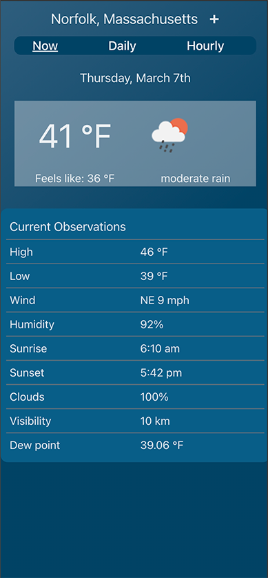
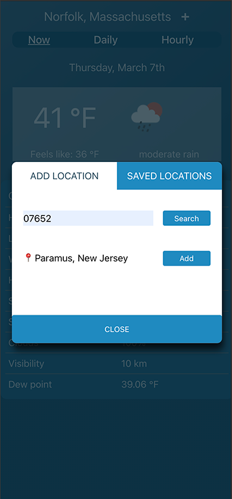
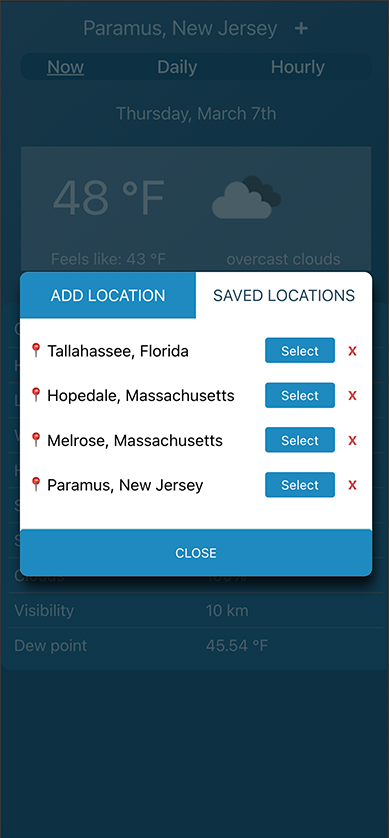

# Weather App

    
    
    

## Introduction
This application is built with React/Vite, TypeScript, responsive CSS, and uses JavaScript fetch to get data from a weather service [OpenWeather](https://openweathermap.org/api) and a geolocation service [LocationIQ](https://locationiq.com/geocoding). To download and run this application you will need api keys from both of these services. I keep an updated version of this application running at https://rdillon.net/weather-app/.

## TODOs
- Implement unit tests for the components
- Add error handling for failed API requests
- Refactor CSS to Tailwind
- ...
